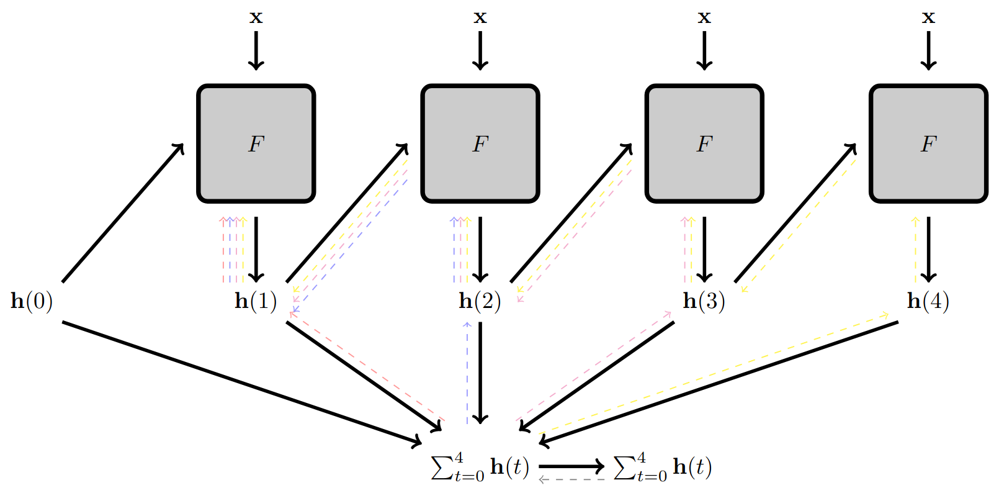

<p align="center">
  
</p>

[](LICENSE)
[](https://mira.inesc-id.pt/dfms)
[](https://arxiv.org/abs/2501.01234)

Deep Feedback Models (DFMs) provide a flexible PyTorch framework for exploring neural architectures with recurrent feedback connections, enabling more biologically inspired and dynamically robust deep learning. This repository includes ready to use implementations of popular backbones such as ResNet and DeepLabV3+, extended with feedback mechanisms for classification and segmentation tasks. Our goal is to make DFMs easily accessible for research and application, while encouraging contributions to broaden the library of supported models. Learn more about the project at our [homepage](https://mira.inesc-id.pt/dfms). 

Below we illustrate the unrolled computational graph of a DFM with $4$ iterations. Dashed lines illustrate the backward pass.

<p align="center">
  
</p>

## Setup

Install this package via pip:

```bash
pip install git+https://github.com/DCalhas/deep_feedback_models.git
```

The requirements are:
| Python package | Version |
|:---------------|:-------:|
| **torch**		 | 2.1.0|
| **skimage** 	 | 0.23.2 |
| **cv2**		 | 4.9.0.80 |
| **numpy**		 | 1.24.4 |
| **torchvision**| 0.16.0 |
| **PIL**		 | 10.2.0 |
| **segmentation_models_pytorch** | 0.2.0 |
| **six** | 1.16.0 |

## Structure and integrated models

The structure of this package is as follows:

<p align="center">
  
</p>

The folder ```models``` contains the implementations of different models, so far we have:

- [X] ResNet18
- [X] ResNet34
- [X] ResNet50
- [X] DeepLabV3+
- [ ] Vision Transformer

We welcome pull requests for the integration of new models with deep feedback connections.

## Minimal example on MNIST

```python
import torch

import torchvision

from dfbmodels.models import ResNet18

train_set=torchvision.datasets.MNIST("/tmp/.", train=True,download=True,)
test_set=torchvision.datasets.MNIST("/tmp/.", train=False)
train_loader=torch.utils.data.DataLoader(train_set, batch_size=32, shuffle=True)

model=ResNet18(frontend='resnet', fb_filters=10, n_classes=10, shape=(28,28), tau=1e0)

loss_fn=torch.nn.CrossEntropyLoss()
optimizer=torch.optim.Adam(model.parameters(), lr=0.01)

model.to(device)

for epoch in range(10):
	model.train(True)

	for batch in train_loader:
		imgs = batch[0]
		targets = batch[1]

		imgs = imgs.to(device=device,)
		targets = targets.to(device=device,).squeeze(1)

		optimizer.zero_grad()

		loss=loss_fn(model(imgs, T=5), targets)
		loss.backward()
		optimizer.step()

test_loss=0.
for x,y in test_set:
	test_loss+=loss_fn(model(x, T=5), y).item()
print("Test loss:", test_loss/len(test_set))
```

## Citation

If you found this repository helpful, please do not forget to cite:
```
@article{calhas2025dfms,
  title={Deep Feedback Models},
  author={Calhas, David and Oliveira, Arlindo L},
  journal={arXiv preprint},
  year={2025}
}
@article{calhas2025dfmsegmentation,
  title={Deep Recurrence for Dynamical Segmentation Models},
  author={Calhas, David and Oliveira, Arlindo L},
  journal={arXiv preprint},
  year={2025}
}
```

## License 

MIT License